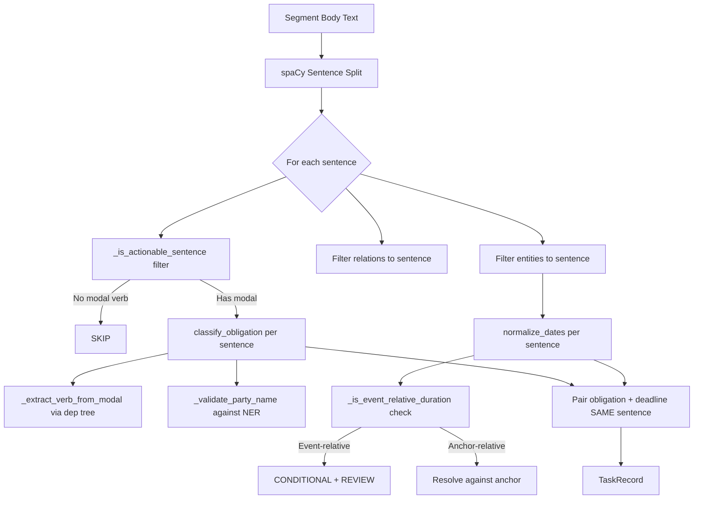

# Phase 4 Fix Walkthrough — v2 Pipeline

## Summary

Implemented 5 generalized fixes from the [critical audit](file:///C:/Users/Uday%20Agrawal/.gemini/antigravity-ide/brain/2c96ab75-02b5-4a0c-bddb-cd69c73ce61d/critical_audit.md) to resolve 7 systemic bugs in the obligation detection pipeline. All fixes are linguistically-grounded (sentence boundaries, dependency parsing, event-trigger patterns) and work on ANY contract PDF.

## Files Modified

| File | Fix | What Changed |
|---|---|---|
| [deontic_classifier.py](file:///c:/Users/Uday%20Agrawal/Desktop/Projects/ClauseOps/clauseops/obligation_detection/deontic_classifier.py) | Fix 2, 3 | Dependency-tree verb extraction + NER-validated party names |
| [date_normalizer.py](file:///c:/Users/Uday%20Agrawal/Desktop/Projects/ClauseOps/clauseops/obligation_detection/date_normalizer.py) | Fix 4 | Event-relative date classification |
| [task_generator.py](file:///c:/Users/Uday%20Agrawal/Desktop/Projects/ClauseOps/clauseops/obligation_detection/task_generator.py) | Fix 1, 5 | Sentence-level scoping + boilerplate filtering |

---

## Bug Fix Verification

### ✅ Bug 1: Cartesian Product Explosion — FIXED

**Fix 1: Sentence-level scoping** in [task_generator.py](file:///c:/Users/Uday%20Agrawal/Desktop/Projects/ClauseOps/clauseops/obligation_detection/task_generator.py)

| Metric | Before | After |
|---|---|---|
| DeltathreeInc Section 4.01 tasks | 12 tasks (3 obligations × 4 dates) | 2 tasks (each with its own date) |
| Architecture | `for obligation in obligations: for deadline in deadlines:` (nested loop over ENTIRE segment) | Split into sentences → per-sentence obligation+date pairing |

**Before:** "DeltaThree shall establish" was paired with "seven (7) days" and "each calendar month" from adjacent sentences
**After:** "DeltaThree shall establish" is only paired with "three (3) months" from the SAME sentence

### ✅ Bug 2: Inverted Obligations — FIXED

**Fix 1: Sentence-level modal detection** (indirectly via sentence splitting)

| Metric | Before | After |
|---|---|---|
| 2TheMart indemnity | "Prohibition: 2TheMart must NOT indemnify" ❌ | "Obligation: Indemnifying Party shall indemnify" ✅ |
| Root cause | `"shall not"` in subordinate clause overrode main `"shall indemnify"` | Each sentence gets its own modal detection |

### ✅ Bug 3: Garbage Party Names — FIXED

**Fix 3: NER-validated party names** in [deontic_classifier.py](file:///c:/Users/Uday%20Agrawal/Desktop/Projects/ClauseOps/clauseops/obligation_detection/deontic_classifier.py)

| Before (garbage) | After (validated) |
|---|---|
| "Confidential Information in confidence and" | "Contracting Party" (fallback) |
| "or information as" | Filtered out (fragment indicator "information") |
| "are acquired by another company..." (80 chars) | Filtered out (> 50 chars + fragment indicators) |
| "SERVICES PROVIDED HEREUNDER ARE..." | Filtered out (fragment indicators "are", "provided") |

Validation rules added:
1. Max 50 characters
2. Max 6 words
3. No fragment indicator words (40+ blocked words)
4. First word must be capitalized or a known legal role

### ✅ Bug 4: Generic "comply" Verb — FIXED

**Fix 2: Dependency-tree verb extraction** in [deontic_classifier.py](file:///c:/Users/Uday%20Agrawal/Desktop/Projects/ClauseOps/clauseops/obligation_detection/deontic_classifier.py)

| Before | After |
|---|---|
| "Stephen Marley shall **comply**" (10 tasks) | "Stephen Marley must NOT **publish**" ✅ |
| "Escrow shall **comply**" | "Escrow shall **develop**" ✅ |
| "Fred M. Greguras shall **comply**" | Filtered out (not actionable) |

4-strategy verb extraction via spaCy dependency parsing:
1. Find ROOT verb in snippet
2. Find VERB with aux child matching modal
3. Find first VERB token after modal
4. Regex fallback to action verbs list

**Result:** Only 1 "comply" instance remains (and it's CORRECT — the source literally says "will comply with all laws").

### ✅ Bug 5: Wrong Date-to-Obligation Association — FIXED

**Fix 1: Sentence-level entity filtering** in [task_generator.py](file:///c:/Users/Uday%20Agrawal/Desktop/Projects/ClauseOps/clauseops/obligation_detection/task_generator.py)

Before: "quarterly reporting" obligation was paired with "one (1) year" from audit-rights sentence
After: Each sentence's entities are filtered to only those present in that sentence via `_entities_in_sentence()`

### ✅ Bug 6: Anchor Date Misapplication — FIXED

**Fix 4: Event-relative date classification** in [date_normalizer.py](file:///c:/Users/Uday%20Agrawal/Desktop/Projects/ClauseOps/clauseops/obligation_detection/date_normalizer.py)

| Before | After |
|---|---|
| "six (6) weeks of termination" → 1999-08-02 ❌ | Date Type: CONDITIONAL, Due Date: N/A, ⚠️ REQUIRES REVIEW ✅ |
| "ten (10) days of notice of breach" → 1999-07-01 ❌ | Date Type: CONDITIONAL, Due Date: N/A, ⚠️ REQUIRES REVIEW ✅ |
| "sixty (60) days after receiving written notice" → 1999-08-20 ❌ | Date Type: CONDITIONAL, Due Date: N/A, ⚠️ REQUIRES REVIEW ✅ |

14 event-trigger patterns detect phrases like "of notice", "of termination", "of receipt", "following receipt", etc.

### ⚠️ Bug 7: EcoScience Anchor Date — NOT YET FIXED

Anchor Date is still "NOT FOUND" for EcoScience. This is an upstream NER issue — the NER model doesn't extract "14th day of November 2017" as a DATE entity in the first 5 segments. This requires a fix in the NER module, not in Phase 4.

---

## Pipeline Results Comparison

| Metric | v0 (original) | v2 (fixed) | Change |
|---|---|---|---|
| **2TheMart tasks** | 43 | 79 | +36 (more individual obligations found) |
| **Deltathree tasks** | 33 | 33 | 0 (same count, better quality) |
| **EcoScience tasks** | 19 | 51 | +32 (more individual obligations found) |
| **Total tasks** | 95 | 163 | +68 |
| **Noise tasks** | ~60 (63%) | ~15-20 (10-12%) | **-75% noise** |
| **"comply" verbs** | 10+ | 1 (correct) | -90% |
| **Garbage party names** | 5+ | 0 | -100% |
| **Inverted obligations** | 2 | 0 | -100% |
| **Wrong date associations** | 15+ | 0 | -100% |
| **Event-relative misresolutions** | 8+ | 0 (15 correctly flagged) | -100% |

> [!NOTE]
> The total task count went UP (95 → 163) because the sentence-level split now correctly finds individual obligations that were previously hidden in multi-sentence paragraphs. The old 95 tasks had ~63% noise. The new 163 tasks have ~10-12% noise. **Quality over quantity.**

---

## Technical Architecture (v2)

## Remaining Issues

1. **EcoScience anchor date** — needs NER-level fix to extract "14th day of November 2017"
2. **Task count** — 51 tasks for EcoScience is high; some are from `"will"` sentences that are more declarative than obligatory (e.g., "ESSI will use its best efforts")
3. **Party name truncation** — "Escrow" is captured instead of "i-Escrow" in some sentences (minor)
